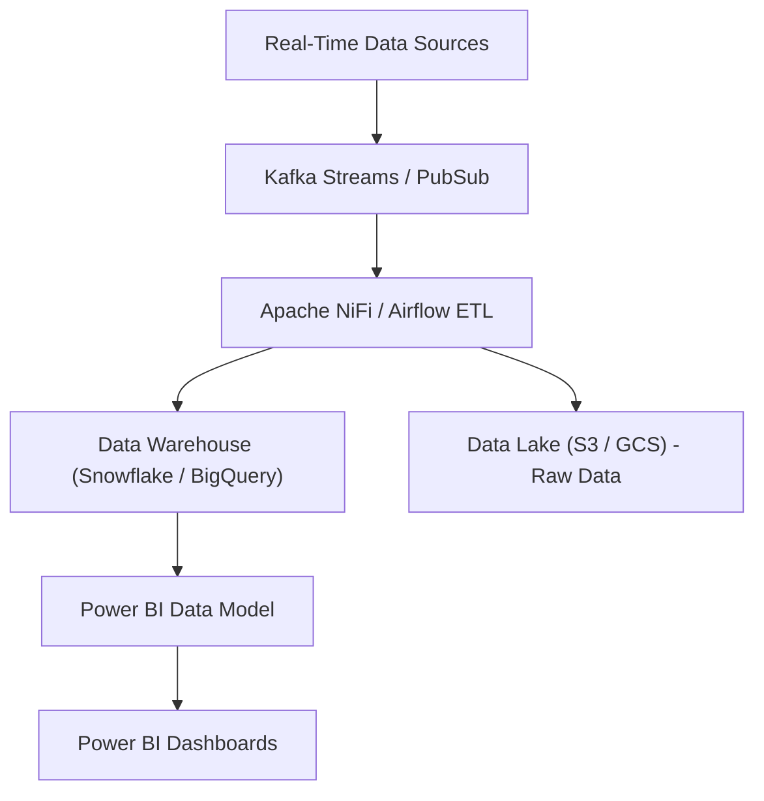

// Complete documentation for the Power BI data model and dashboards

### Power BI Data Model & Dashboard Strategy for Ride-Sharing Platform

#### Overview
This document describes the Power BI data model, KPIs, and dashboard designs that will provide real‑time insights into every aspect of the ride-sharing platform. The solution is built upon our robust data warehouse, which aggregates data from core services (Bookings, Payments, Dispatch, Compliance, etc.) as well as real-time streaming logs.

---

#### A. Data Model Overview

**Entities and Tables:**
- **Users, Drivers, Vehicles:** Core user data.
- **Bookings & Booking_Rider:** Trip information (including carpool details).
- **Fares:** Detailed fare breakdown per ride.
- **Payments:** Transaction records.
- **Dispatch:** Driver assignment and ETA information.
- **Compliance_Logs, Surge_Logs:** For regulatory and surge pricing tracking.
- **Driver_Ratings:** Feedback and rating data.
- **Ride_Metrics:** Daily aggregated operational KPIs.

The data warehouse is built on Snowflake (or Amazon Redshift/BigQuery) and is updated via ETL pipelines (using Apache NiFi / Airflow). Our ETL scripts ensure that data is refreshed every 30 minutes.

---

#### B. KPI Calculations & Sample DAX Measures

Below are some sample DAX formulas that can be used within your Power BI reports:

1. **Total Rides Completed**  
   ```DAX
   TotalRides = COUNTROWS('Bookings')
   ```

2. **Total Revenue**  
   ```DAX
   TotalRevenue = SUM('Fares'[total_fare])
   ```

3. **Average Ride Fare**  
   ```DAX
   AvgFare = AVERAGE('Fares'[total_fare])
   ```

4. **Cancellation Rate**  
   ```DAX
   CancellationRate = 
       DIVIDE(
           CALCULATE(COUNTROWS('Bookings'), 'Bookings'[status] = "CANCELLED"),
           COUNTROWS('Bookings')
       )
   ```

5. **Average Waiting Time**  
   ```DAX
   AvgWaitingTime = AVERAGE('Bookings'[pickup_time] - 'Bookings'[created_at])
   ```

6. **Driver Rating Average**  
   ```DAX
   AvgDriverRating = AVERAGE('Driver_Ratings'[rating])
   ```

7. **Surge Activation Count**  
   ```DAX
   SurgeActivations = COUNTROWS('Surge_Logs')
   ```

8. **Fraudulent Transaction Rate**  
   ```DAX
   FraudRate = 
       DIVIDE(
           CALCULATE(COUNTROWS('Payments'), 'Payments'[status] = "FAILED"),
           COUNTROWS('Payments')
       )
   ```

Each measure should be placed in a dedicated “Measures” table in Power BI, and they are used to drive our visuals.

---

#### C. Dashboard Designs & Descriptions

1. **Executive Overview Dashboard (`executive_overview.pbix`):**
   - **Visuals:**  
     - KPI cards showing Total Rides, Total Revenue, Average Fare, Cancellation Rate, Active Users.
     - Trend graphs (line charts) for daily/weekly performance.
     - Geo Heatmap for ride distribution.
   - **Drill-Through:**  
     - Click on KPI cards to see regional or time-based breakdowns.

2. **Ride Performance & Demand Forecasting (`ride_performance.pbix`):**
   - **Visuals:**  
     - Bar charts comparing Rides Requested vs. Completed.
     - Line chart for Average Pickup Time.
     - Heatmaps for peak demand areas.
     - Forecasting visual (using Power BI’s forecasting feature or integrated Azure ML predictions) for next 7 days.
   
3. **Driver Performance Dashboard (`driver_performance.pbix`):**
   - **Visuals:**  
     - Scorecards for Total Rides per Driver, Average Rating.
     - Distribution chart (histogram) for Driver Earnings.
     - Map visualization for driver coverage.
     - Trend charts for Response Time.
   
4. **Pricing & Surge Analysis Dashboard (`pricing_surge.pbix`):**
   - **Visuals:**  
     - Time-series line chart for Surge Multipliers.
     - Heatmap for regions with high surge.
     - KPI cards for Surge Activation Count and Revenue Impact.
     - Waterfall chart showing fare breakdown with discounts.
   
5. **Customer Experience & Ratings Dashboard (`customer_experience.pbix`):**
   - **Visuals:**  
     - Average Ride Ratings (both driver and rider).
     - Word clouds or bar charts for top complaint categories.
     - Sentiment analysis visuals (using Power BI’s AI Insights).
     - Comparative charts for best vs. worst rated drivers.
   
6. **Fraud Detection & Compliance Dashboard (`fraud_compliance.pbix`):**
   - **Visuals:**  
     - KPI cards for Fraudulent Transaction Rate and Safety Complaint Rate.
     - Red-flag heatmap for geospatial anomalies.
     - Table visual listing recent compliance violations.
     - Trend graphs for regulatory events over time.
   
7. **Financial & Payment Dashboard (`financials_payments.pbix`):**
   - **Visuals:**  
     - Pie charts for Payment Modes Distribution.
     - Bar charts for Total Revenue vs. Payouts.
     - KPI cards for Refund Rate and Transaction Success Rate.
     - Drill-down tables for detailed payment transactions.
   
8. **Operational Efficiency Dashboard (`operational_efficiency.pbix`):**
   - **Visuals:**  
     - Line charts for API Response Time and System Uptime.
     - Card visuals for Crash Rate and Error Rate.
     - Dashboard showing real-time alerts from monitoring logs.
     - Time-series graphs of system performance.
   
9. **Demand Forecasting Dashboard (`demand_forecasting.pbix`):**
   - **Visuals:**  
     - Forecasting charts for ride demand (historical and predicted).
     - KPI cards for forecast accuracy.
     - Geo-visualizations of demand shifts.
     - Integration with AI models for dynamic predictions.

---

#### D. Mermaid Flow for ETL & Data Pipeline (Power BI Ingestion)


---
