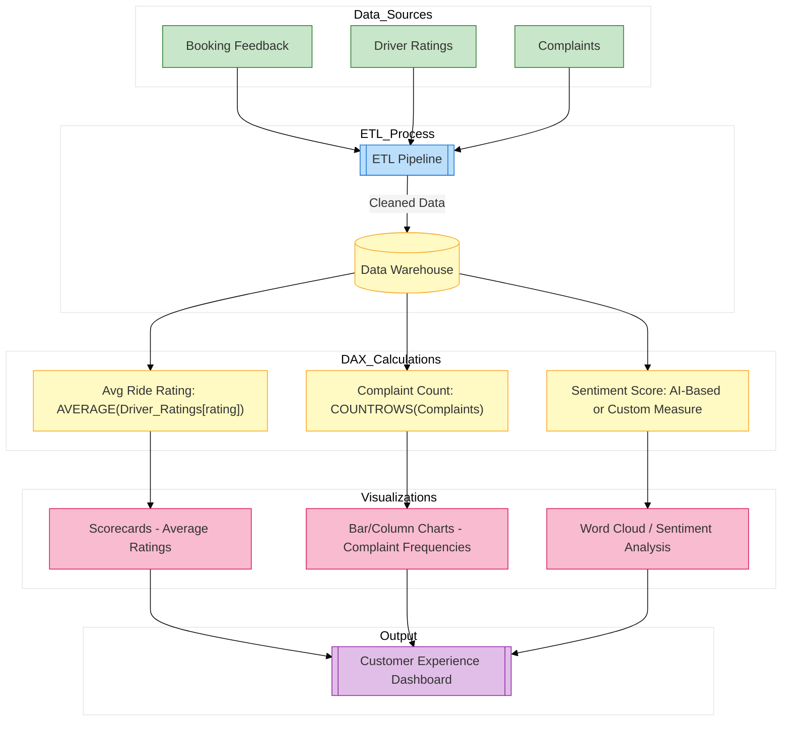

// Report for ride ratings, feedback, and sentiment analysis
*Description:*  
Focuses on customer feedback and sentiment, including average ride ratings and complaint analysis.

**Report Contents Specification:**

- **KPIs & Measures:**  
  - **Average Ride Rating (Rider & Driver):**  
    ```DAX
    AvgRideRating = AVERAGE('Driver_Ratings'[rating])
    ```
  - **Complaint Count by Category:** (Assumes a table or categorization exists)  
  - **Sentiment Score:** Use Power BI’s AI Insights or a custom DAX measure for textual analysis.
  
- **Visuals:**  
  - Scorecards for average ratings  
  - Bar/Column charts for complaint frequencies  
  - Word cloud or sentiment visual for feedback analysis

*Implementation:*  
Set up the data model and visuals in Power BI Desktop; then save as `customer_experience.pbix`.


