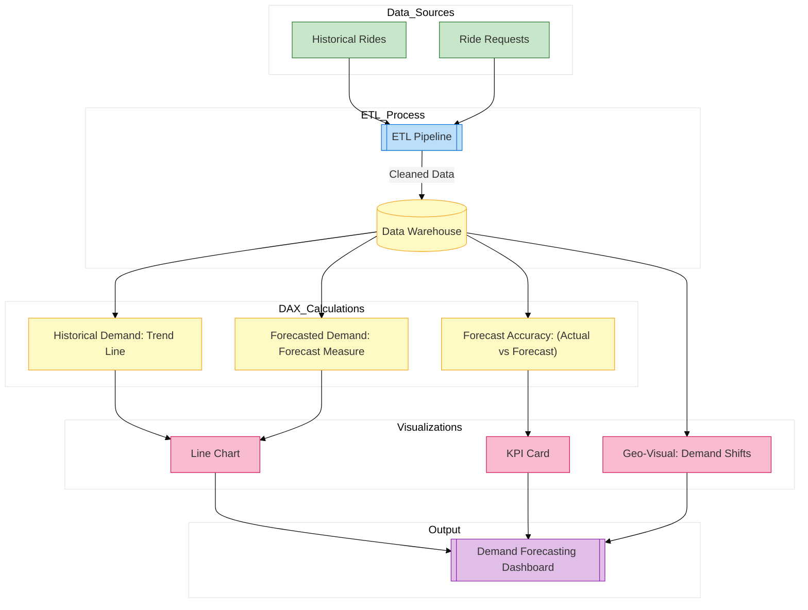

// Report for historical demand and AI-driven forecasting
*Description:*  
Forecasts future ride demand using historical data and integrates AI-driven insights.

**Report Contents Specification:**

- **KPIs & Measures:**  
  - **Historical Ride Demand:** Trend line from historical data.
  - **Forecasted Demand:** Use Power BI forecasting or integrate Azure ML output.
  - **Forecast Accuracy:** Calculated measure comparing forecast vs. actual.
  
- **Visuals:**  
  - Line chart with forecasting overlay  
  - KPI card for forecast accuracy  
  - Geo-visualization of demand shifts
  
*Implementation:*  
Construct the report in Power BI Desktop, using built-in forecasting features and DAX measures, then save as `demand_forecasting.pbix`.

