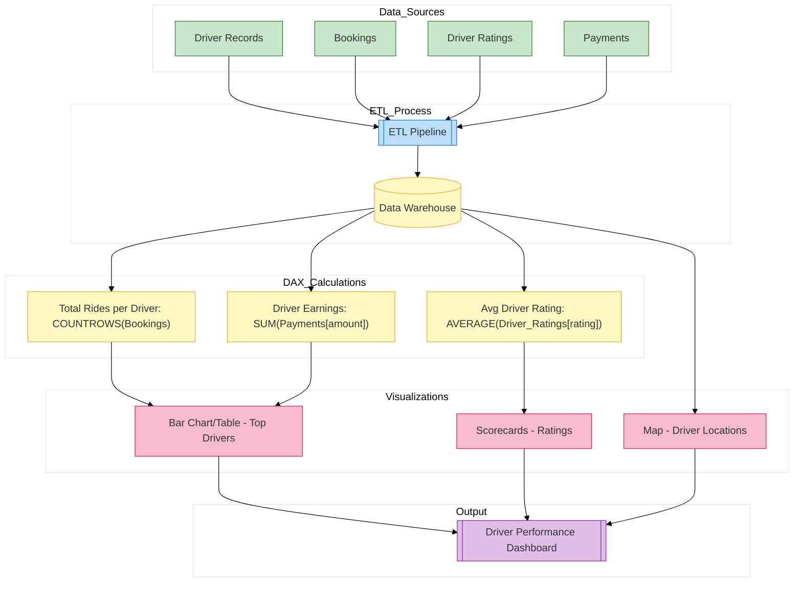

// Report for driver metrics, ratings, and earnings
*Description:*  
Tracks driver performance, including total rides per driver, ratings, earnings, and geographic coverage.

**Report Contents Specification:**

- **KPIs & Measures:**  
  - **Total Rides per Driver:**  
    ```DAX
    RidesPerDriver = COUNTROWS('Bookings')
    ```
    (Filtered by driver_id.)  
  - **Average Driver Rating:**  
    ```DAX
    AvgDriverRating = AVERAGE('Driver_Ratings'[rating])
    ```
  - **Driver Earnings:** Aggregate earnings from a dedicated payments table.
  
- **Visuals:**  
  - Bar chart or table visual for top drivers by rides and earnings  
  - Scorecards for average ratings  
  - Map visual showing driver locations (if available)

*Implementation:*  
Configure the visuals and DAX measures in Power BI Desktop; then save as `driver_performance.pbix`.


