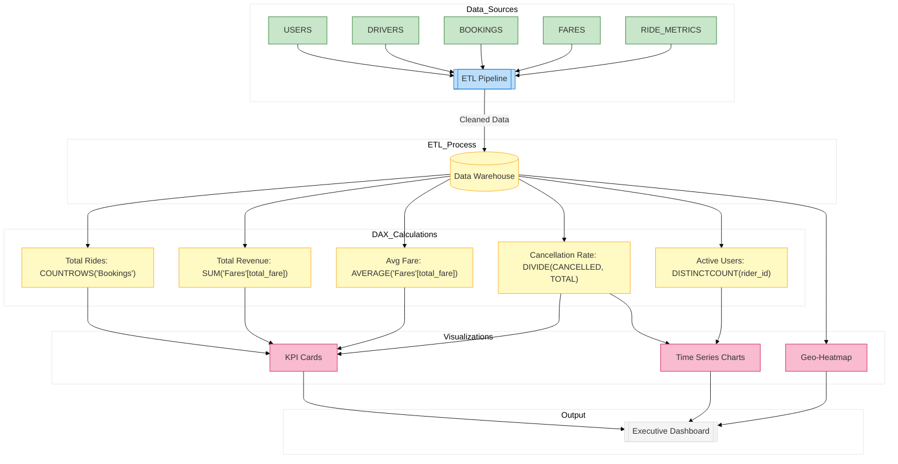

// Report file for high-level KPIs and business health

*Description:*  
This Power BI report provides an executive view of the overall business health. It includes KPI cards, trend lines, and geo-heatmaps.

**Report Contents Specification:**

- **Data Model:**  
  - Tables: USERS, DRIVERS, BOOKINGS, FARES, PAYMENTS, RIDE_METRICS, etc. (imported from your data warehouse)  
- **KPIs:**  
  - **Total Rides Completed:**  
    ```DAX
    TotalRides = COUNTROWS('Bookings')
    ```
  - **Total Revenue:**  
    ```DAX
    TotalRevenue = SUM('Fares'[total_fare])
    ```
  - **Average Ride Fare:**  
    ```DAX
    AvgFare = AVERAGE('Fares'[total_fare])
    ```
  - **Cancellation Rate:**  
    ```DAX
    CancellationRate = DIVIDE(CALCULATE(COUNTROWS('Bookings'), 'Bookings'[status] = "CANCELLED"), COUNTROWS('Bookings'))
    ```
  - **Active Users:** Count distinct users from BOOKINGS (rider_id).  

- **Visuals:**  
  - KPI Tiles (cards) for Total Rides, Total Revenue, Avg Fare, Cancellation Rate  
  - Time series charts (line charts) for daily and weekly trends  
  - A geo-heatmap showing ride distribution by region  

*Implementation:*  
Create these visuals in Power BI Desktop using the above DAX measures, format them in a clean layout, and save as `executive_overview.pbix`.


