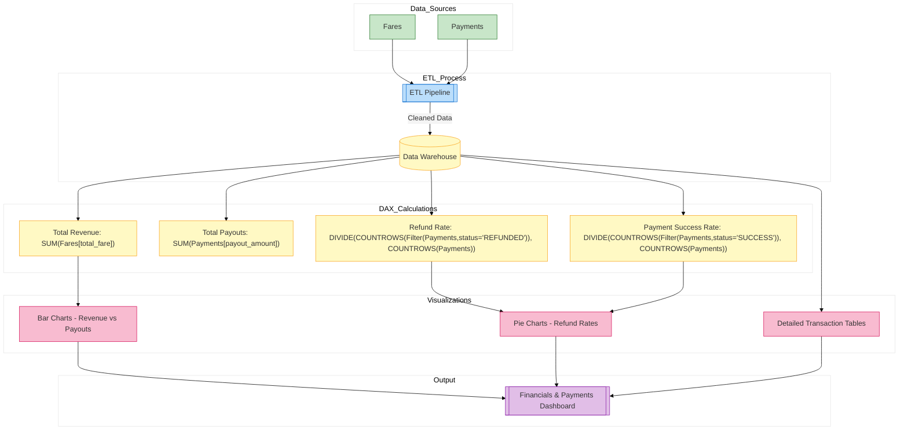

// Report for revenue, payment success, refund rates, and commission breakdown
*Description:*  
Tracks financial metrics including revenue, payouts, refund rates, and payment method performance.

**Report Contents Specification:**

- **KPIs & Measures:**  
  - **Total Revenue:**  
    ```DAX
    TotalRevenue = SUM('Fares'[total_fare])
    ```
  - **Total Payouts to Drivers:** (Assume a related table or calculation)
  - **Refund Rate:**  
    ```DAX
    RefundRate = DIVIDE(CALCULATE(COUNTROWS('Payments'), 'Payments'[status] = "REFUNDED"), COUNTROWS('Payments'))
    ```
  - **Payment Success Rate:**  
    ```DAX
    PaymentSuccess = DIVIDE(CALCULATE(COUNTROWS('Payments'), 'Payments'[status] = "SUCCESS"), COUNTROWS('Payments'))
    ```
  
- **Visuals:**  
  - Pie charts for distribution of payment methods  
  - Bar charts comparing revenue and payouts  
  - Tables showing detailed payment transactions

*Implementation:*  
Develop the report in Power BI Desktop; then save as `financials_payments.pbix`.


