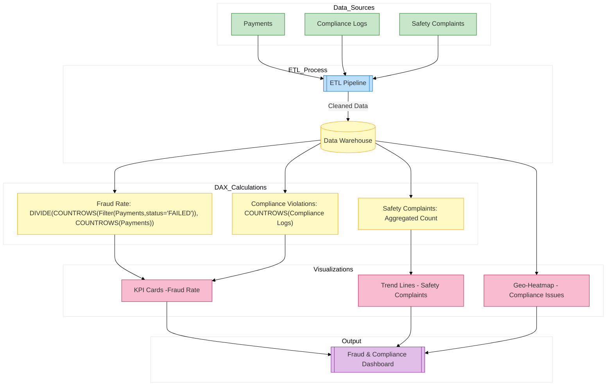

// Report for fraud detection, compliance violations, and safety issues
*Description:*  
Monitors fraud detection, compliance violations, and safety issues.

**Report Contents Specification:**

- **KPIs & Measures:**  
  - **Fraudulent Transaction Rate:**  
    ```DAX
    FraudRate = DIVIDE(CALCULATE(COUNTROWS('Payments'), 'Payments'[status] = "FAILED"), COUNTROWS('Payments'))
    ```
  - **Compliance Violation Count:** Count rows in COMPLIANCE_LOGS.
  - **Safety Complaints:** Aggregated from feedback logs.
  
- **Visuals:**  
  - Red-flag KPI cards for fraud and compliance  
  - Heatmap showing geographic compliance issues  
  - Trend lines for regulatory violations over time

*Implementation:*  
Build these visuals in Power BI Desktop and save as `fraud_compliance.pbix`.


