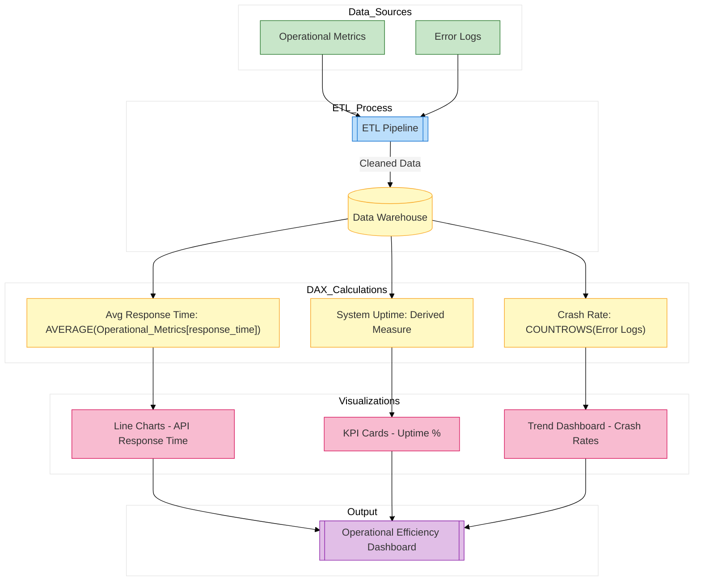

// Report for API uptime, latency, crash rates, and system health
*Description:*  
Provides insights into system performance, including API response times, system uptime, and crash rates.

**Report Contents Specification:**

- **KPIs & Measures:**  
  - **API Response Time:**  
    ```DAX
    AvgResponseTime = AVERAGE('OperationalMetrics'[response_time])
    ```
    (Assumes an OperationalMetrics table exists)
  - **System Uptime:** Calculated from logs.
  - **Crash Rate:** Derived from error logs.
  
- **Visuals:**  
  - Time series charts for API latency  
  - Card visuals for uptime percentage  
  - Dashboard of error rate trends

*Implementation:*  
Set up in Power BI Desktop with the provided measures; then save as `operational_efficiency.pbix`.


