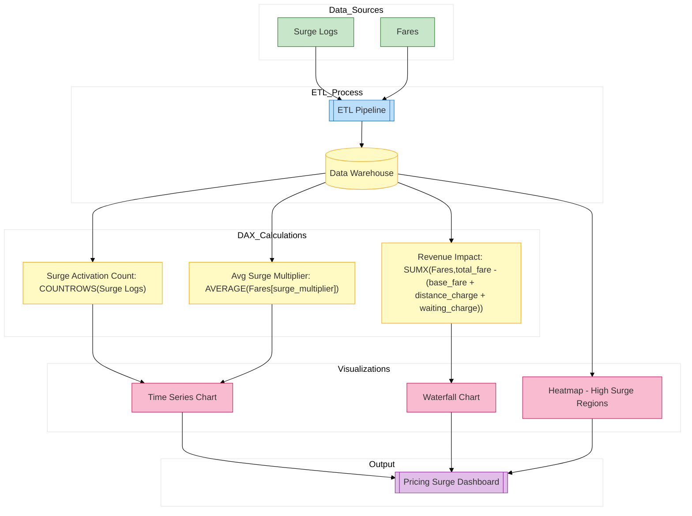

// Report for surge pricing, fare fluctuations, and revenue impact
*Description:*  
Monitors surge pricing activations, fare fluctuations, and the revenue impact of surge pricing.

**Report Contents Specification:**

- **KPIs & Measures:**  
  - **Surge Activation Count:**  
    ```DAX
    SurgeActivations = COUNTROWS('Surge_Logs')
    ```
  - **Revenue Impact from Surge:**  
    ```DAX
    RevenueImpact = SUMX('Fares', ('Fares'[total_fare] - ('Fares'[base_fare] + 'Fares'[distance_charge] + 'Fares'[waiting_charge])))
    ```
  - **Average Surge Multiplier:**  
    ```DAX
    AvgSurge = AVERAGE('Fares'[surge_multiplier])
    ```
  
- **Visuals:**  
  - Time series chart of surge multipliers over time  
  - Heatmap of regions with high surge values  
  - Waterfall chart showing fare breakdown

*Implementation:*  
Design these visuals and measures in Power BI Desktop and save as `pricing_surge.pbix`.


