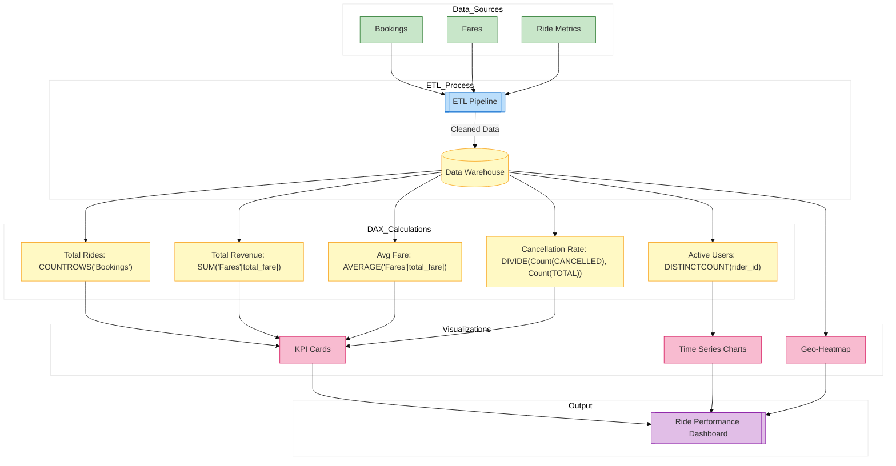

// Report for ride completion rates, pickup times, and demand heatmaps
*Description:*  
Focuses on ride metrics such as ride requests versus completions, average pickup times, and demand heatmaps.

**Report Contents Specification:**

- **KPIs & Measures:**  
  - **Rides Requested vs Completed:**  
    ```DAX
    RidesRequested = COUNTROWS('Booking_Requests')
    ```
    (Assume you have a staging table for ride requests.)  
  - **Average Pickup Time:**  
    ```DAX
    AvgPickupTime = AVERAGE('Bookings'[pickup_time] - 'Bookings'[created_at])
    ```
  - **Peak Hours & Demand:**  
    Create a calculated column for hour-of-day and then aggregate rides per hour.
  
- **Visuals:**  
  - Bar charts comparing ride requests and completions  
  - Line chart for average pickup time over the day  
  - Heatmap showing high-demand areas (using geographic data)

*Implementation:*  
Build these visuals in Power BI Desktop with the appropriate DAX measures, then save as `ride_performance.pbix`.


