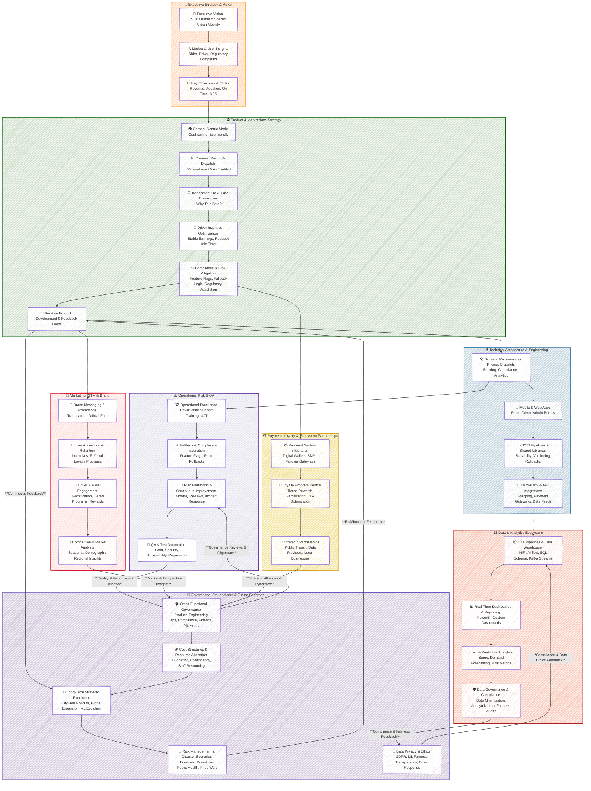

# Ridesharing Marketplace Ecosystem

```mermaid
---
config:
  look: handDrawn
---
flowchart TD
 subgraph A["🎯 Executive Strategy & Vision"]
        A1["🚀 Executive Vision <br> Sustainable &amp; Shared Urban Mobility"]
        A2["🔍 Market &amp; User Insights <br> Rider, Driver, Regulatory, Competitor"]
        A3["📊 Key Objectives &amp; OKRs <br> Revenue, Adoption, On-Time, NPS"]
  end
 subgraph B["♻️ Product & Marketplace Strategy"]
        B1["🌍 Carpool-Centric Model <br> Cost-saving, Eco-friendly"]
        B2["📈 Dynamic Pricing &amp; Dispatch <br> Param-based &amp; AI-Enabled"]
        B3@{ label: "💡 Transparent UX &amp; Fare Breakdown <br> 'Why This Fare?'" }
        B4["🚗 Driver Incentive Optimization <br> Stable Earnings, Reduced Idle Time"]
        B5["⚖️ Compliance &amp; Risk Mitigation <br> Feature Flags, Fallback Logic, Regulatory Adaptation"]
        B6["🔄 Iterative Product Development & Feedback Loops"]
  end
 subgraph C["🖥️ Technical Architecture & Engineering"]
        C1["🛠️ Backend Microservices <br> Pricing, Dispatch, Booking, Compliance, Analytics"]
        C2["📱 Mobile &amp; Web Apps <br> Rider, Driver, Admin Portals"]
        C3["🚀 CI/CD Pipelines &amp; Shared Libraries <br> Scalability, Versioning, Rollbacks"]
        C4["🔗 Third-Party &amp; API Integrations <br> Mapping, Payment Gateways, Data Feeds"]
  end
 subgraph D["📊 Data & Analytics Ecosystem"]
        D1["📦 ETL Pipelines &amp; Data Warehouse <br> NiFi, Airflow, SQL Schema, Kafka Streams"]
        D2["📊 Real-Time Dashboards &amp; Reporting <br> PowerBI, Custom Dashboards"]
        D3["🤖 ML &amp; Predictive Analytics <br> Surge, Demand Forecasting, Risk Metrics"]
        D4["🛡️ Data Governance &amp; Compliance <br> Data Minimization, Anonymization, Fairness Audits"]
  end
 subgraph E["⚠️ Operations, Risk & QA"]
        E1["🏆 Operational Excellence <br> Driver/Rider Support, Training, UAT"]
        E2["⚠️ Fallback &amp; Compliance Integration <br> Feature Flags, Rapid Rollbacks"]
        E3["🛑 Risk Monitoring &amp; Continuous Improvement <br> Monthly Reviews, Incident Response"]
        E4["🧪 QA &amp; Test Automation <br> Load, Security, Accessibility, Regression"]
  end
 subgraph F["📣 Marketing, GTM & Brand"]
        F1["📣 Brand Messaging &amp; Promotions <br> Transparent, Official Fares"]
        F2["🎁 User Acquisition &amp; Retention <br> Incentives, Referral, Loyalty Programs"]
        F3["🏅 Driver &amp; Rider Engagement <br> Gamification, Tiered Programs, Rewards"]
        F4["🔬 Competitive &amp; Market Analysis <br> Seasonal, Demographic, Regional Insights"]
  end
 subgraph G["💳 Payment, Loyalty & Ecosystem Partnerships"]
        G1["💳 Payment System Integration <br> Digital Wallets, BNPL, Failover Gateways"]
        G2["🎯 Loyalty Program Design <br> Tiered Rewards, Gamification, CLV Optimization"]
        G3["🤝 Strategic Partnerships <br> Public Transit, Data Providers, Local Businesses"]
  end
 subgraph H["📌 Governance, Stakeholders & Future Roadmap"]
        H1["🛠️ Cross-Functional Governance <br> Product, Engineering, Ops, Compliance, Finance, Marketing"]
        H2["💰 Cost Structures &amp; Resource Allocation <br> Budgeting, Contingency, Staff Resourcing"]
        H3["🚀 Long-Term Strategic Roadmap <br> Citywide Rollouts, Global Expansion, ML Evolution"]
        H4["🚨 Risk Management &amp; Disaster Scenarios <br> Economic Downturns, Public Health, Price Wars"]
        H5["🔏 Data Privacy &amp; Ethics <br> GDPR, ML Fairness, Transparency, Crisis Response"]
  end
    A1 --> A2
    A2 --> A3
    A3 --> B1
    B1 --> B2
    B2 --> B3
    B3 --> B4
    B4 --> B5
    B5 --> B6 & G1
    B6 -- **Continuous Feedback** --> H3
    B6 --> C1 & F1
    C1 --> C2 & E1
    C2 --> C3
    C3 --> C4
    C4 --> D1
    D1 --> D2
    D2 --> D3
    D3 --> D4
    D4 -- **Compliance & Fairness Feedback** --> H5
    E1 --> E2
    E2 --> E3
    E3 --> E4
    E4 -- **Quality & Performance Reviews** --> H1
    F1 --> F2
    F2 --> F3
    F3 --> F4
    F4 -- **Market & Competitive Insights** --> H1
    G1 --> G2
    G2 --> G3
    G3 -- **Strategic Alliances & Synergies** --> H1
    H1 --> H2
    H2 --> H3
    H3 --> H4
    H4 -- **Risk/Incident Feedback** --> B6
    H5 -- **Compliance &amp; Data Ethics Feedback** --> D1
    H1 -- **Governance Reviews & Alignment** --> E3
    B3@{ shape: rect}
     A1:::Class_02
     A2:::Class_02
     A3:::Class_02
     B1:::Class_02
     B2:::Class_02
     B3:::Class_02
     B4:::Class_02
     B5:::Class_02
     B6:::Class_02
     C1:::Class_02
     C2:::Class_02
     C3:::Class_02
     C4:::Class_02
     D1:::Class_02
     D2:::Class_02
     D3:::Class_02
     D4:::Class_02
     E1:::Class_02
     E2:::Class_02
     E3:::Class_02
     E4:::Class_02
     F1:::Class_02
     F2:::Class_02
     F3:::Class_02
     F4:::Class_02
     G1:::Class_02
     G2:::Class_02
     G3:::Class_02
     H1:::Class_02
     H2:::Class_02
     H3:::Class_02
     H4:::Class_02
     H5:::Class_02
    classDef Class_01 stroke-width:4px, stroke-dasharray: 5
    classDef Class_02 fill:#FFF
    style G fill:#F3E5A0,stroke:#DAA520,stroke-width:2px
    style A fill:#FFDDC0,stroke:#FF8C00,stroke-width:2px
    style B fill:#D4E2D0,stroke:#006400,stroke-width:2px
    style C fill:#C8D8E0,stroke:#4682B0,stroke-width:2px
    style D fill:#F8CFC0,stroke:#B22220,stroke-width:2px
    style E fill:#E6E6F0,stroke:#4B0080,stroke-width:2px
    style F fill:#FDE4E0,stroke:#DC1430,stroke-width:2px
    style H fill:#D8CFE0,stroke:#6A5AC0,stroke-width:2px
 

```
