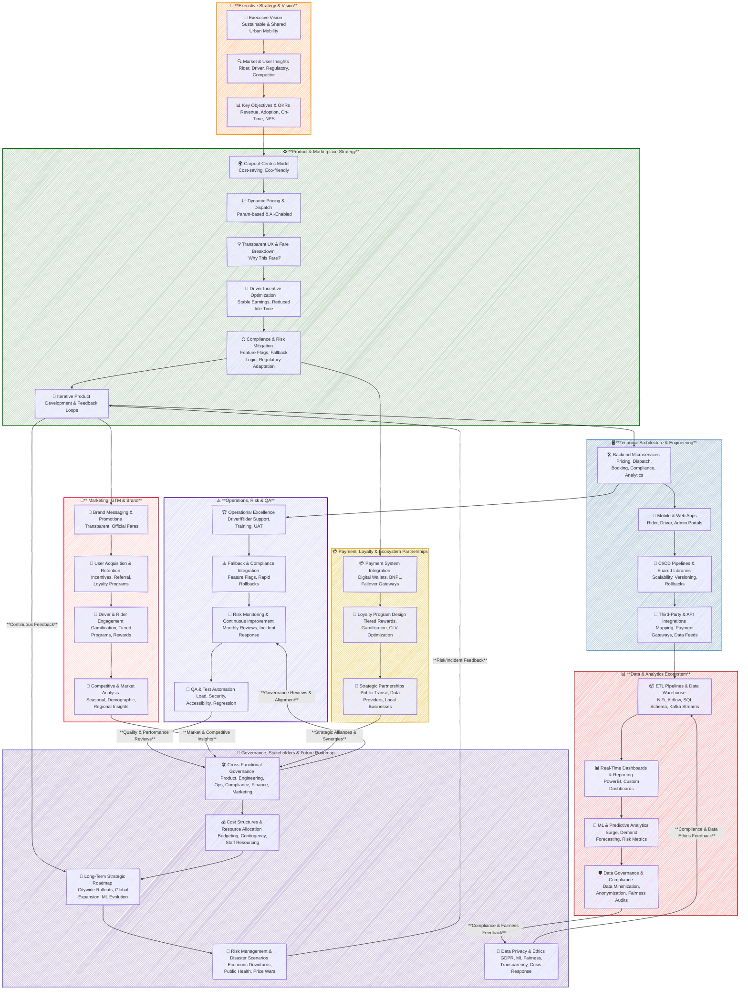

# Ridesharing Marketplace Ecosystem

```mermaid
---
config:
  look: handDrawn
---
flowchart TD
  %% ================================
  %% EXECUTIVE STRATEGY & VISION
  %% ================================
  subgraph A["🎯 **Executive Strategy & Vision**"]
    A1["🚀 Executive Vision <br> Sustainable & Shared Urban Mobility"]
    A2["🔍 Market & User Insights <br> Rider, Driver, Regulatory, Competitor"]
    A3["📊 Key Objectives & OKRs <br> Revenue, Adoption, On-Time, NPS"]
  end
  style A fill:#FFDDC1,stroke:#FF8C00,stroke-width:2px

  %% ================================
  %% PRODUCT & MARKETPLACE STRATEGY
  %% ================================
  subgraph B["♻️ **Product & Marketplace Strategy**"]
    B1["🌍 Carpool-Centric Model <br> Cost-saving, Eco-friendly"]
    B2["📈 Dynamic Pricing & Dispatch <br> Param-based & AI-Enabled"]
    B3["💡 Transparent UX & Fare Breakdown <br> 'Why This Fare?'"]
    B4["🚗 Driver Incentive Optimization <br> Stable Earnings, Reduced Idle Time"]
    B5["⚖️ Compliance & Risk Mitigation <br> Feature Flags, Fallback Logic, Regulatory Adaptation"]
    B6["🔄 Iterative Product Development & Feedback Loops"]
  end
  style B fill:#D4E2D4,stroke:#006400,stroke-width:2px

  %% ================================
  %% TECHNICAL ARCHITECTURE
  %% ================================
  subgraph C["🖥️ **Technical Architecture & Engineering**"]
    C1["🛠️ Backend Microservices <br> Pricing, Dispatch, Booking, Compliance, Analytics"]
    C2["📱 Mobile & Web Apps <br> Rider, Driver, Admin Portals"]
    C3["🚀 CI/CD Pipelines & Shared Libraries <br> Scalability, Versioning, Rollbacks"]
    C4["🔗 Third-Party & API Integrations <br> Mapping, Payment Gateways, Data Feeds"]
  end
  style C fill:#C8D8E4,stroke:#4682B4,stroke-width:2px

  %% ================================
  %% DATA & ANALYTICS
  %% ================================
  subgraph D["📊 **Data & Analytics Ecosystem**"]
    D1["📦 ETL Pipelines & Data Warehouse <br> NiFi, Airflow, SQL Schema, Kafka Streams"]
    D2["📊 Real-Time Dashboards & Reporting <br> PowerBI, Custom Dashboards"]
    D3["🤖 ML & Predictive Analytics <br> Surge, Demand Forecasting, Risk Metrics"]
    D4["🛡️ Data Governance & Compliance <br> Data Minimization, Anonymization, Fairness Audits"]
  end
  style D fill:#F8CFCF,stroke:#B22222,stroke-width:2px

  %% ================================
  %% OPERATIONS, RISK & QA
  %% ================================
  subgraph E["⚠️ **Operations, Risk & QA**"]
    E1["🏆 Operational Excellence <br> Driver/Rider Support, Training, UAT"]
    E2["⚠️ Fallback & Compliance Integration <br> Feature Flags, Rapid Rollbacks"]
    E3["🛑 Risk Monitoring & Continuous Improvement <br> Monthly Reviews, Incident Response"]
    E4["🧪 QA & Test Automation <br> Load, Security, Accessibility, Regression"]
  end
  style E fill:#E6E6FA,stroke:#4B0082,stroke-width:2px

  %% ================================
  %% MARKETING, GTM & BRAND
  %% ================================
  subgraph F["📣** Marketing, GTM & Brand**"]
    F1["📣 Brand Messaging & Promotions <br> Transparent, Official Fares"]
    F2["🎁 User Acquisition & Retention <br> Incentives, Referral, Loyalty Programs"]
    F3["🏅 Driver & Rider Engagement <br> Gamification, Tiered Programs, Rewards"]
    F4["🔬 Competitive & Market Analysis <br> Seasonal, Demographic, Regional Insights"]
  end
  style F fill:#FDE4E1,stroke:#DC143C,stroke-width:2px

  %% ================================
  %% PAYMENT, LOYALTY & PARTNERSHIPS
  %% ================================
  subgraph G["💳 Payment, Loyalty & Ecosystem Partnerships"]
    G1["💳 Payment System Integration <br> Digital Wallets, BNPL, Failover Gateways"]
    G2["🎯 Loyalty Program Design <br> Tiered Rewards, Gamification, CLV Optimization"]
    G3["🤝 Strategic Partnerships <br> Public Transit, Data Providers, Local Businesses"]
  end
  style G fill:#F3E5AB,stroke:#DAA520,stroke-width:2px

  %% ================================
  %% GOVERNANCE & ROADMAP
  %% ================================
  subgraph H["📌 Governance, Stakeholders & Future Roadmap"]
    H1["🛠️ Cross-Functional Governance <br> Product, Engineering, Ops, Compliance, Finance, Marketing"]
    H2["💰 Cost Structures & Resource Allocation <br> Budgeting, Contingency, Staff Resourcing"]
    H3["🚀 Long-Term Strategic Roadmap <br> Citywide Rollouts, Global Expansion, ML Evolution"]
    H4["🚨 Risk Management & Disaster Scenarios <br> Economic Downturns, Public Health, Price Wars"]
    H5["🔏 Data Privacy & Ethics <br> GDPR, ML Fairness, Transparency, Crisis Response"]
  end
  style H fill:#D8CFE5,stroke:#6A5ACD,stroke-width:2px

  %% ================================
  %% FLOW CONNECTIONS
  %% ================================
  A1 --> A2
  A2 --> A3
  A3 --> B1
  B1 --> B2
  B2 --> B3
  B3 --> B4
  B4 --> B5
  B5 --> B6 & G1
  B6 -- **Continuous Feedback** --> H3
  B6 --> C1 & F1
  C1 --> C2 & E1
  C2 --> C3
  C3 --> C4
  C4 --> D1
  D1 --> D2
  D2 --> D3
  D3 --> D4
  D4 -- **Compliance & Fairness Feedback** --> H5
  E1 --> E2
  E2 --> E3
  E3 --> E4
  E4 -- **Quality & Performance Reviews** --> H1
  F1 --> F2
  F2 --> F3
  F3 --> F4
  F4 -- **Market & Competitive Insights** --> H1
  G1 --> G2
  G2 --> G3
  G3 -- **Strategic Alliances & Synergies** --> H1
  H1 --> H2
  H2 --> H3
  H3 --> H4
  H4 -- **Risk/Incident Feedback** --> B6
  H5 -- **Compliance & Data Ethics Feedback** --> D1
  H1 -- **Governance Reviews & Alignment** --> E3

```
