[9. Engineering & Architecture Overview](#9-engineering--architecture-overview)
   - Tech Stack
   - Architecture

---

### 9. Engineering & Architecture Overview

**Architecture Goals:**
Enable rapid changes—e.g., toggling feature_flag, updating parameters for a zone—without downtime, ensuring stable performance and easy scaling.

**Key Enhancements:**
- Microservices for pricing logic, compliance checks, data ingestion, booking, trip, vehicles, user management, payment processing, analytics  
- Versioned APIs ensure backward compatibility for at least 2 releases, so if a compliance-driven model emerges, we integrate seamlessly without breaking existing flows.
- Dispatch for Carpool and Matching Engine services using location-based algorithms.
- CI/CD pipelines ensure every commit is tested. If performance dips, add caching layers or refine indexing before merging. If a pen test reveals vulnerability, fix immediately.

**Third-Party Integrations**  
- Mapping/Navigation APIs (e.g., Google Maps, OpenStreetMap).  
- Payment Gateways & Wallets. (Bank Cards, Digital Wallets, Corporate cards, BNPL) 
- SMS/Push Notification Providers

**Scalability & Reliability:**
- If scaling to 30% city coverage triggers latency >2s, horizontally scale pricing microservice pods, or add a read-replica DB.  
- Regular DR drills ensure we never get caught off-guard. If a DR drill fails, fix root causes before next increment.
- Auto-scaling cloud infrastructure (AWS, Azure, GCP) with multi-region failover.  
- Real-time monitoring (Prometheus, Grafana, Splunk) for anomalies.
- Data Analytics(DataDog)
- Product Analytics(Amplitude, Mixpanel, Clevertap)

**Integration with ML:**
- Designed so that plugging in ML-driven is a matter of adding another microservice or endpoint. If ML fails, revert to old logic instantly. This ensures no complexity sacrifices user trust or compliance.

**Tech Stack:**

```mermaid
flowchart TD

    subgraph Backend
        B1["Java with Spring Boot"]
        B2["Spring Web MVC (REST APIs)"]
        B3["Spring Security (OAuth 2.0 / JWT)"]
        B4["Apache Kafka / RabbitMQ (Messaging)"]
        B5["Spring Cloud Gateway / Kong (API Gateway)"]
    end

    subgraph Data_Persistence
        D1["PostgreSQL / MySQL (Relational)"]
        D2["Redis (Cache, Session)"]
        D3["MongoDB (NoSQL)"]
    end

    subgraph Monitoring_Logging
        M1["Prometheus & Grafana"]
        M2["ELK / EFK Stack (Logging)"]
    end

    subgraph CI_CD_Deployment
        C1["GitHub Actions / Jenkins"]
        C2["Docker & Kubernetes"]
        C3["Terraform (Infrastructure as Code)"]
        C4["Blue/Green, Canary, Rolling Deployments"]
    end

    subgraph Mobile_Apps
        MA1["iOS (Swift)"]
        MA2["Android (Kotlin)"]
        MA3["Optional: React Native"]
        MA4["Fastlane (Mobile CI/CD)"]
        MA5["Remote Config: Firebase"]
    end

    subgraph Frontend_Admin_Portal
        F1["ReactJS"]
        F2["PWA Support (Optional)"]
    end

    subgraph Data_Analytics
        DA1["Apache NiFi / Python ETL"]
        DA2["Amazon Redshift / BigQuery"]
        DA3["Tableau / Grafana"]
        DA4["ML: PyTorch"]
    end

    subgraph Payment_Processing
        P1["Stripe"]
        P2["Tokenization & Secure Processing"]
        P3["Digital Wallet Integration"]
    end

    subgraph DevOps_Infrastructure
        DO1["AWS / Azure / GCP"]
        DO2["Docker Hub / AWS ECR"]
        DO3["Nginx (Load Balancer)"]
    end

    subgraph Third_Party_Integrations
        T1["Google Maps API (Routing, Traffic)"]
        T2["Firebase (Push Notifications/SMS)"]
    end

    subgraph Collaboration_Tools
        CT1["Git (Version Control)"]
        CT2["JIRA & Confluence (Project Management)"]
    end

    %% Connections
    B1 -->|Uses| B2
    B1 -->|Uses| B3
    B1 -->|Uses| B4
    B1 -->|Uses| B5
    B1 -->|Stores Data In| D1
    B1 -->|Caches Data In| D2
    B1 -->|Stores Unstructured Data In| D3
    B1 -->|Communicates via Events| B4

    M1 -->|Monitors| B1
    M1 -->|Monitors| C2
    M2 -->|Logs| B1
    M2 -->|Logs| C2

    C1 -->|Triggers Deployments in| C2
    C2 -->|Deploys Using| C3
    C2 -->|Supports| C4

    MA1 -->|Calls APIs| B1
    MA2 -->|Calls APIs| B1
    MA3 -->|Optional Support| MA1
    MA3 -->|Optional Support| MA2
    MA4 -->|Automates Deployment| MA1
    MA4 -->|Automates Deployment| MA2
    MA5 -->|Manages Feature Flags| MA1
    MA5 -->|Manages Feature Flags| MA2

    F1 -->|Calls APIs| B1
    F1 -->|Optional PWA| F2

    DA1 -->|ETL Processing| DA2
    DA2 -->|Data Storage| DA3
    DA3 -->|Data Visualization| DA4
    DA4 -->|ML Deployment| B1

    P1 -->|Processes Payments| P2
    P2 -->|Secures Transactions| P3

    DO1 -->|Cloud Infrastructure| DO2
    DO2 -->|Stores Containers| DO3
    DO3 -->|Handles Traffic| B1

    T1 -->|Used for Geolocation| B1
    T2 -->|Sends Notifications| MA1
    T2 -->|Sends Notifications| MA2

    CT1 -->|Source Control| B1
    CT1 -->|Source Control| F1
    CT2 -->|Project Tracking| B1
    CT2 -->|Project Tracking| F1
```

**Architecture:**

```mermaid
flowchart TD
    subgraph Mobile_Apps
      A1["iOS App (Swift)"]
      A2["Android App (Kotlin)"]
    end

    subgraph Admin_Web_Portal
      B1["Admin Web Portal (React/Angular)"]
    end

    subgraph API_Gateway
      C["API Gateway (Spring Cloud Gateway / Kong)"]
    end

    subgraph Authentication
      D["Auth Service (OAuth 2.0/JWT)"]
    end

    subgraph Backend_Services
      E["Pricing Service (Spring Boot)"]
      F["Dispatch Service (Spring Boot)"]
      G["Booking Service (Spring Boot)"]
      H["Payment Service (Spring Boot)"]
      I["Compliance Service (Spring Boot)"]
      J["Geocoding Service (Spring Boot)"]
      K["Analytics Service (Spring Boot)"]
    end

    subgraph Data_Persistence_Cache
      L["PostgreSQL/MySQL"]
      M["Redis Cache"]
      N["NoSQL / MongoDB"]
    end

    subgraph Messaging_Event_Bus
      O["Kafka / RabbitMQ"]
    end

    subgraph Monitoring_Logging
      P["Prometheus/Grafana"]
      Q["ELK Stack"]
    end

    subgraph Deployment_Orchestration
      R["Kubernetes (Docker containers)"]
      S["Terraform IaC"]
    end

    %% Connections
    A1 -- API Calls --> C
    A2 -- API Calls --> C
    B1 -- API Calls --> C

    C -- Authentication --> D
    C -- Routes Requests --> E
    C -- Routes Requests --> F
    C -- Routes Requests --> G
    C -- Routes Requests --> H
    C -- Routes Requests --> I
    C -- Routes Requests --> J
    C -- Routes Requests --> K

    E -- DB Read/Write --> L
    F -- DB Read/Write --> L
    G -- DB Read/Write --> L
    H -- DB Read/Write --> L
    I -- DB Read/Write --> L
    J -- Caching/Session --> M
    K -- Analytics Data --> N

    E -- Events --> O
    F -- Events --> O
    G -- Events --> O
    H -- Events --> O
    I -- Events --> O

    R -- Hosts --> E
    R -- Hosts --> F
    R -- Hosts --> G
    R -- Hosts --> H
    R -- Hosts --> I
    R -- Hosts --> J
    R -- Hosts --> K

    P -- Collects Metrics --> R
    Q -- Aggregates Logs --> R

    %% Deployment Strategies
    classDef deployStyle fill:#f9f,stroke:#333,stroke-width:2px,stroke-dasharray: 5 5
    class R deployStyle
    %% Labels for Deployment Approaches (blue-green, canary, rolling)
    R -- Blue/Green/Canary/Rolling --> S

```

